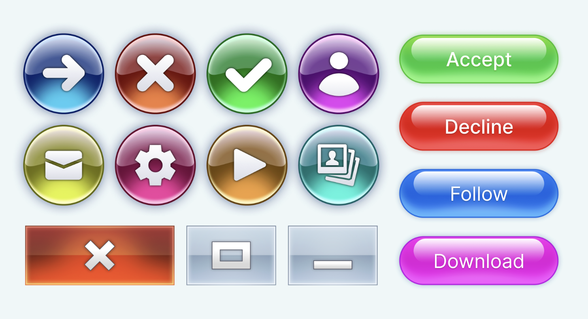
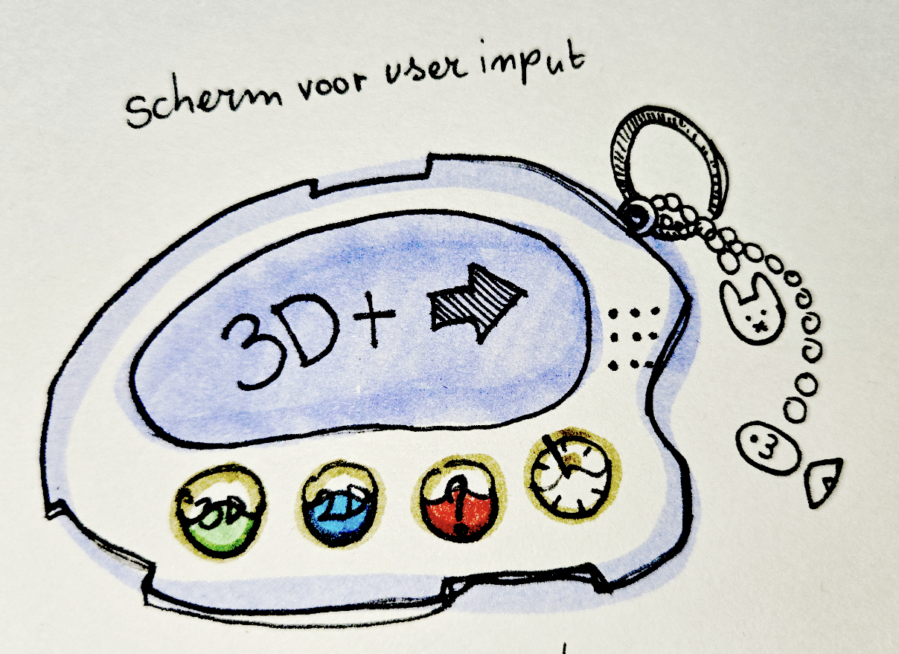

# CSS
CSS - mwdd

### dag 1 
#### 18.2.2026
Carousel gemaakt met Romy, Thije en Braham, er was geen checkout vandaag!

### dag 2 
#### 19.2.2026
Checkout met Nils

Wat heb ik vandaag gedaan?
- Leuke 3d draai gemaakt met css
[eerste](https://codepen.io/alishasoedamah/pen/EayBpja)
[tweede](https://codepen.io/alishasoedamah/pen/raLEQNE)
- De carousel opdracht gepresenteerd met Romy [repo](https://github.com/Braham3030/Css_carousel_webDev/tree/main)

Hoeveel tijd heeft me dat gekost?
3 uur voor het schrijven van code en opzoeken van voorbeelden
ong 2 uur naar presentaties geluisterd
1 uur geluisterd naar de brief van de eindopdracht
en het laatste uur de weekly nerd van Peter-Paul Koch
geluisterd.

Wat heb ik geleerd?
rotateZ()
translateZ()
in keyframes

Wat ga ik morgen doen?
CSS + BT voortgang bespreken, bespreken wat ik ga doen voor de eindopdracht van dit vak

### Week 1

   
Mijn eerste idee

   Fruiger aero pannel die een trippy achtergrond bestuurd. Ik wil een 2d/3d toggle button tussen states maken.

   Inspo voor de buttons van de interface:
   

   Inspo container voor de buttons:
   

   Dit is een snelle schets van wat het kan worden
   
   - 2/3d buttons voor de toggle
   - Een ? mode -> ik weet nog niet wat dit gaat worden
   - Draai button voor om de rotatie kant te veranderen
   - Scherm om de input van de user te laten zien

   Voor de achtergrond had ik een beetje dit in gedachte:
   
   - [inspo 1](https://codepen.io/soju22/pen/ywLZPV) 
Volgens Sanne is dit makkelijk te doen.
   - [inspo 2](https://codepen.io/cathbailh/pen/xGBMbV)
   - [inspo 3](https://codepen.io/dazld/pen/DydWyz)
   - [inspo 4](https://codepen.io/atzedent/pen/VwORRGv)

### dag 3
#### 4.3.2026
### dag 4 
#### 5.3.2026
### Week 2

   
week 2 voortgang

### dag 5
#### 11.3.2026
### dag 6
#### 12.3.2026
### Week 3

   
week 3 voortgang

### dag 7
#### 18.3.2026

### dag 8
#### 19.3.2026

### Week 4

   
week 4 voortgang

