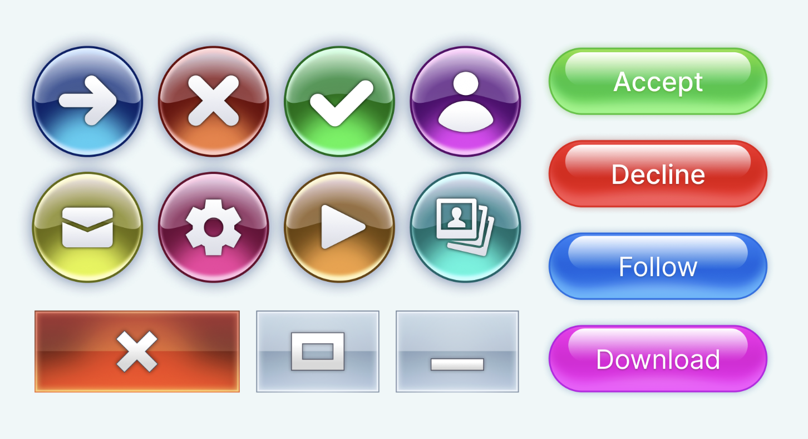
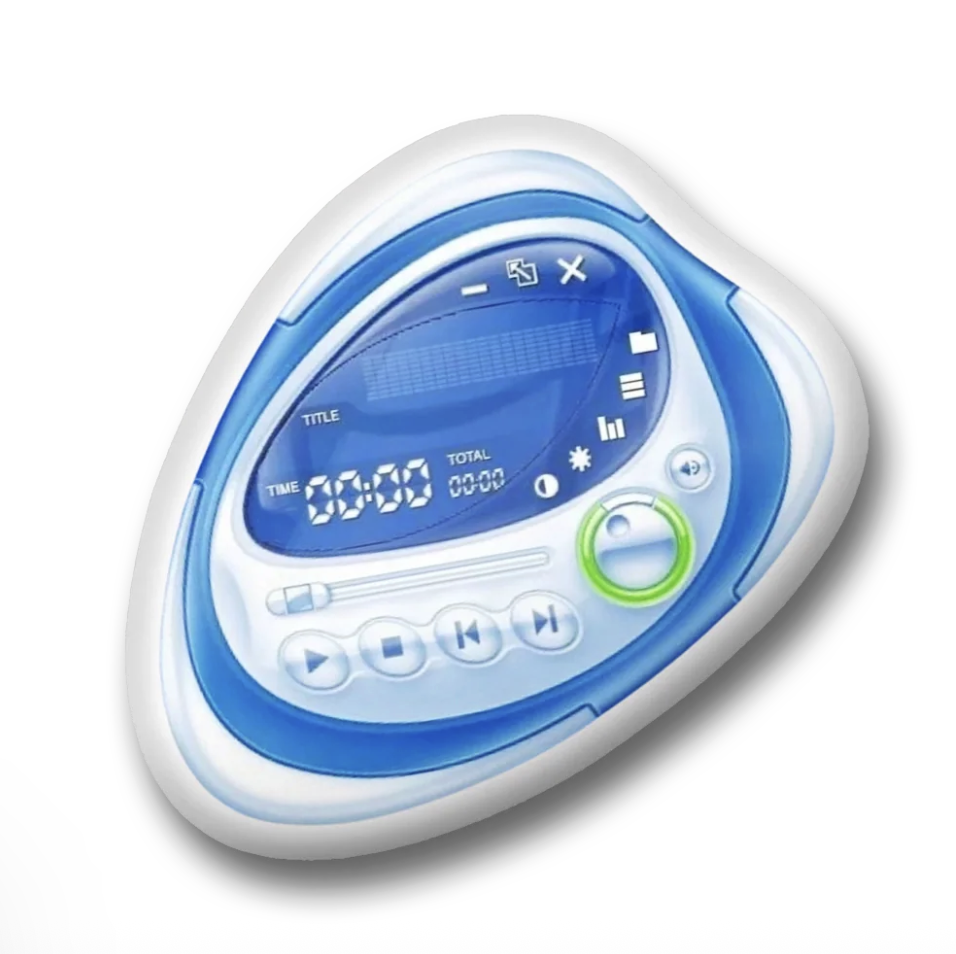
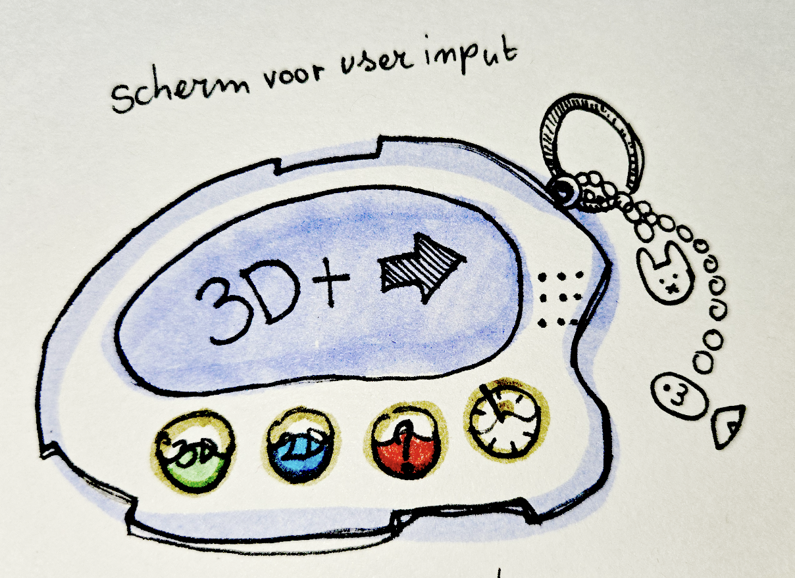
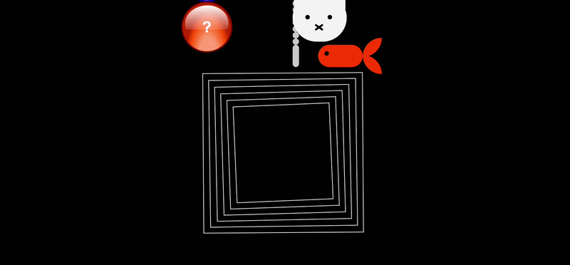

# CSS
CSS - mwdd

### dag 1 
#### 18.2.2026
Carousel gemaakt met Romy, Thije en Braham, er was geen checkout vandaag!

### dag 2 
#### 19.2.2026
Checkout met Nils

Wat heb ik vandaag gedaan?
- Leuke 3d draai gemaakt met css
[eerste](https://codepen.io/alishasoedamah/pen/EayBpja)
[tweede](https://codepen.io/alishasoedamah/pen/raLEQNE)
- De carousel opdracht gepresenteerd met Romy [repo](https://github.com/Braham3030/Css_carousel_webDev/tree/main)

Hoeveel tijd heeft me dat gekost?
3 uur voor het schrijven van code en opzoeken van voorbeelden
ong 2 uur naar presentaties geluisterd
1 uur geluisterd naar de brief van de eindopdracht
en het laatste uur de weekly nerd van Peter-Paul Koch
geluisterd.

Wat heb ik geleerd?
rotateZ()
translateZ()
in keyframes

Wat ga ik morgen doen?
CSS + BT voortgang bespreken, bespreken wat ik ga doen voor de eindopdracht van dit vak

### Week 1
<details open>
   <summary>Mijn eerste idee</summary>
   Fruiger aero pannel die een trippy achtergrond bestuurd. Ik wil een 2d/3d toggle button tussen states maken.

   Inspo voor de buttons van de interface:
   

   Inspo container voor de buttons:
   

   Dit is een snelle schets van wat het kan worden
   
   - 2/3d buttons voor de toggle
   - Een ? mode -> ik weet nog niet wat dit gaat worden
   - Draai button voor om de rotatie kant te veranderen
   - Scherm om de input van de user te laten zien


   Voor de achtergrond had ik een beetje dit in gedachte:
   
   - [inspo 1](https://codepen.io/soju22/pen/ywLZPV) 
Volgens Sanne is dit makkelijk te doen.
   - [inspo 2](https://codepen.io/cathbailh/pen/xGBMbV)
   - [inspo 3](https://codepen.io/dazld/pen/DydWyz)
   - [inspo 4](https://codepen.io/atzedent/pen/VwORRGv)

</details>

### dag 3
#### 4.3.2026
3D workshop van Sanne

Om een element 3D te maken heb je ```perspective: (10em);``` en ```transform-style: preserve-3d```nodig.
[Dingen die stuk](https://css-tricks.com/things-watch-working-css-3d/) gaan als je 3D gebruikt in CSS. 
```grid-area: 1/1;``` om alles op dezelfde plek te zetten in als je met 3D gaat werken. Layout tab in de inspector voor als je beter wilt werken met grid. 

```
grid-area: 1/1/2/2; is eigenlijk dit

grid-row-start: 1;
grid-column-start: 1;
grid-row-end: 2;
grid-column-end: 2;
```

animation-delay: calc(1s / sibling-count() * (sibling-index));

[sibling-index()](https://developer.mozilla.org/en-US/docs/Web/CSS/Reference/Values/sibling-index)

Advanced Layouts van Niels

Je kunt responsive layouts maken met 1 lijn code in je grid container, auto-fill/auto-fit ipv mediaqueries.
```grid-template-columns: repeat(auto-fill, minmax(10rem, 1fr));```
flex-basis: 0; maakt alle containers even groot, flex-basis: 200px; geeft ze een andere width

[blog](https://9elements.com/blog/building-a-rock-solid-auto-grid/)

Checkout met Aya A

Wat heb ik vandaag gedaan?
De workshop van Sanne gevolgd, de Weekly nerd van Nils gedaan, verder aan de eindopdracht

Hoeveel tijd heeft me dat gekost?
3 uur voor de code
de rest van de tijd ging naar de WN en de 2 workshops.

Wat heb ik geleerd?
Auto-grid minmax property

Wat ga ik morgen doen?
Dit vak en nog een WN, de input fixen als je op de buttons klikt

### dag 4 
#### 5.3.2026

Workshop van Nils
```animation-delay: calc(sibling-index() * -0.5s) reverse```
```animation-delay: calc(sibling-index() * 0.5s) normaal```

[oklch](https://oklch.com/#0.7,0.1,188,100)

Code om met een input iets te laten zien (alleen met CSS has)
HTML
```
<label>
  <input type="radio" value="2D" name="dimension">2D
</label>

<p></p>

```
CSS
```
body:has([value="2D"]:checked) p::before {
  content:"2D ";
}
```
Checkout met Senna

Wat heb ik vandaag gedaan?
De workshop van Nils gevolgd over @property in css, de input waardes komen nu op het scherm.
Een beetje aan de achtergrond van de site gewerkt. 

Hoeveel tijd heeft me dat gekost?
5 uur voor de code
de rest van de tijd ging naar de 2 workshops.

Wat heb ik geleerd?
Hoe je dingen wel en niet kan laten zien met een toggle in CSS.

Wat ga ik morgen doen?
Voortgang bespreken van dit vak en BT. Kijken wat er nodig is om de achtergrond te veranderen in 3d enof ik er nog wat aan kan toevoegen.

### Week 2
<details>
   <summary>week 2 voortgang</summary>
   Notes van Sanne: 
   - Moet nog iets met typografie doen dat past bij de website
   - New css architecture features: @layer, container queries, style queries, @functions, if()
   - sibling-index voor de 3d animatie

   Op de planning van volgende week:

   - Laat de borders licht geven op de ? optie. 
   - Gebruik nog een architecture feature.
   - Maak een leuke header font om te oefenen met typografie in CSS
   - Maak het een geheel
   - De performance van de site
</details>

# Animatie experimenten
<details>
   <summary>Klik hierop om mijn animatie experimenten te zien!</summary>

   Eerste animatie met rotate: 
   

   Meer blokjes in de lijst en van 4s naar 2s
   
</details>

### dag 5
#### 11.3.2026

Wat heb ik vandaag gedaan?
Hoeveel tijd heeft me dat gekost?
Wat heb ik geleerd?
Wat ga ik morgen doen?

### dag 6
#### 12.3.2026
t heb ik vandaag gedaan?
Hoeveel tijd heeft me dat gekost?
Wat heb ik geleerd?
Wat ga ik morgen doen?

### Week 3
<details>
   <summary>week 3 voortgang</summary>
</details>

### dag 7
#### 18.3.2026

### dag 8
#### 19.3.2026

### Week 4
<details>
   <summary>week 4 voortgang</summary>
</details>

### ref
CSS heeft zoveel. 

[Gradient](https://developer.mozilla.org/en-US/play?uuid=80f6e3699c0e8b6c3b303a843d628ab813704dd3&state=VY1NDoMgGESv8mVWbYL9MV1R60nYoBChIhpA28R494aw6mqSl3kzO0yaHDgaZTfqnYzxJRDttDhdBamsdAJtc1V2a4UHQx8jOHJ5F57oY1UynOrHbfk%2BMzDaDiZxuteFHMJf%2FuaK18l%2BHMK8esWp8GrIqX06Ba0YdW7V5%2BKD4Z1PwZCMnnT%2Bl2HE8QM%3D&srcPrefix=%2Fen-US%2Fdocs%2FWeb%2FCSS%2FGuides%2FImages%2FUsing_gradients%2F)
[Inner shadow](https://css-tricks.com/snippets/css/css-box-shadow/)
[Shapes thx Nils](https://9elements.github.io/fancy-border-radius/#61.39.31.24--.)