# CSS to the rescue
CSS - mwdd
Pure CSS control panel!
```
   CSS structure:

   ├── styles/main.css              geeft alles op de pagina een stijl
   ├── styles/functionality.css     :has @container, laat user input zien en laat zien welke knop is ingedrukt
   ├── styles/animations.css        @keyframes, alle animaties
   ├── styles/pixelart.css          kleine deco bovenaan de panel
   ├── styles/responsive.css        @mediaqueries
   └── styles/themes.css            color vars voor alles
```
### dag 1 
#### 18.2.2026
Carousel gemaakt met Romy, Thije en Braham, er was geen checkout vandaag!

### dag 2 
#### 19.2.2026
Checkout met Nils

Wat heb ik vandaag gedaan?
- Leuke 3d draai gemaakt met css
[eerste](https://codepen.io/alishasoedamah/pen/EayBpja)
[tweede](https://codepen.io/alishasoedamah/pen/raLEQNE)
- De carousel opdracht gepresenteerd met Romy [repo](https://github.com/Braham3030/Css_carousel_webDev/tree/main)

Hoeveel tijd heeft me dat gekost?
3 uur voor het schrijven van code en opzoeken van voorbeelden
ong 2 uur naar presentaties geluisterd
1 uur geluisterd naar de brief van de eindopdracht
en het laatste uur de weekly nerd van Peter-Paul Koch
geluisterd.

Wat heb ik geleerd?
rotateZ()
translateZ()
in keyframes

Wat ga ik morgen doen?
CSS + BT voortgang bespreken, bespreken wat ik ga doen voor de eindopdracht van dit vak

### Week 1
<details open>
   <summary>Mijn eerste idee</summary>
   Fruiger aero panel die een trippy achtergrond bestuurd. Ik wil een 2d/3d toggle button tussen states maken.

   Inspo voor de buttons van de interface:
   

   Inspo container voor de buttons:
   

   Dit is een snelle schets van wat het kan worden
   
   - 2/3d buttons voor de toggle
   - Een ? mode -> ik weet nog niet wat dit gaat worden
   - Draai button voor om de rotatie kant te veranderen
   - Scherm om de input van de user te laten zien


   Voor de achtergrond had ik een beetje dit in gedachte:
   
   - [inspo 1](https://codepen.io/soju22/pen/ywLZPV) 
Volgens Sanne is dit makkelijk te doen.
   - [inspo 2](https://codepen.io/cathbailh/pen/xGBMbV)
   - [inspo 3](https://codepen.io/dazld/pen/DydWyz)
   - [inspo 4](https://codepen.io/atzedent/pen/VwORRGv)

</details>

### dag 3
#### 4.3.2026
3D workshop van Sanne

Om een element 3D te maken heb je ```perspective: (10em);``` en ```transform-style: preserve-3d```nodig.
[Dingen die stuk](https://css-tricks.com/things-watch-working-css-3d/) gaan als je 3D gebruikt in CSS. 
```grid-area: 1/1;``` om alles op dezelfde plek te zetten in als je met 3D gaat werken. Layout tab in de inspector voor als je beter wilt werken met grid. 

```
grid-area: 1/1/2/2; is eigenlijk dit

grid-row-start: 1;
grid-column-start: 1;
grid-row-end: 2;
grid-column-end: 2;
```

animation-delay: calc(1s / sibling-count() * (sibling-index));

[sibling-index()](https://developer.mozilla.org/en-US/docs/Web/CSS/Reference/Values/sibling-index)

Advanced Layouts van Niels

Je kunt responsive layouts maken met 1 lijn code in je grid container, auto-fill/auto-fit ipv mediaqueries.
```grid-template-columns: repeat(auto-fill, minmax(10rem, 1fr));```
flex-basis: 0; maakt alle containers even groot, flex-basis: 200px; geeft ze een andere width

[blog](https://9elements.com/blog/building-a-rock-solid-auto-grid/)

Checkout met Aya A

Wat heb ik vandaag gedaan?
De workshop van Sanne gevolgd, de Weekly nerd van Nils gedaan, verder aan de eindopdracht

Hoeveel tijd heeft me dat gekost?
3 uur voor de code
de rest van de tijd ging naar de WN en de 2 workshops.

Wat heb ik geleerd?
Auto-grid minmax property

Wat ga ik morgen doen?
Dit vak en nog een WN, de input fixen als je op de buttons klikt

### dag 4 
#### 5.3.2026

Workshop van Nils
```animation-delay: calc(sibling-index() * -0.5s) reverse```
```animation-delay: calc(sibling-index() * 0.5s) normaal```

[oklch](https://oklch.com/#0.7,0.1,188,100)

Code om met een input iets te laten zien (alleen met CSS has)
HTML
```
<label>
  <input type="radio" value="2D" name="dimension">2D
</label>

<p></p>

```
CSS
```
body:has([value="2D"]:checked) p::before {
  content:"2D ";
}
```
Checkout met Senna

Wat heb ik vandaag gedaan?
De workshop van Nils gevolgd over @property in css, de input waardes komen nu op het scherm.
Een beetje aan de achtergrond van de site gewerkt. 

Hoeveel tijd heeft me dat gekost?
5 uur voor de code
de rest van de tijd ging naar de 2 workshops.

Wat heb ik geleerd?
Hoe je dingen wel en niet kan laten zien met een toggle in CSS.

Wat ga ik morgen doen?
Voortgang bespreken van dit vak en BT. Kijken wat er nodig is om de achtergrond te veranderen in 3d enof ik er nog wat aan kan toevoegen.

### Week 2
<details>
   <summary>week 2 voortgang</summary>
   Notes van Sanne: 
   
   - Moet nog iets met typografie doen dat past bij de website (denk iets met een video tijdlijn)
   - New css architecture features: @layer, container queries, style queries, @functions, if()
   - sibling-index voor de 3d animatie

   Op de planning van volgende week:

   - Laat de borders licht geven op de ? optie. 
   - Gebruik nog een architecture feature.
   - Maak een leuke header font om te oefenen met typografie in CSS
   - Maak het een geheel
   - De performance van de site
</details>

# Animatie experimenten
<details>
   <summary>Klik hierop om mijn animatie experimenten te zien!</summary>

   Eerste animatie met rotate: 
   

   Meer blokjes in de lijst en van 4s naar 2s
   

   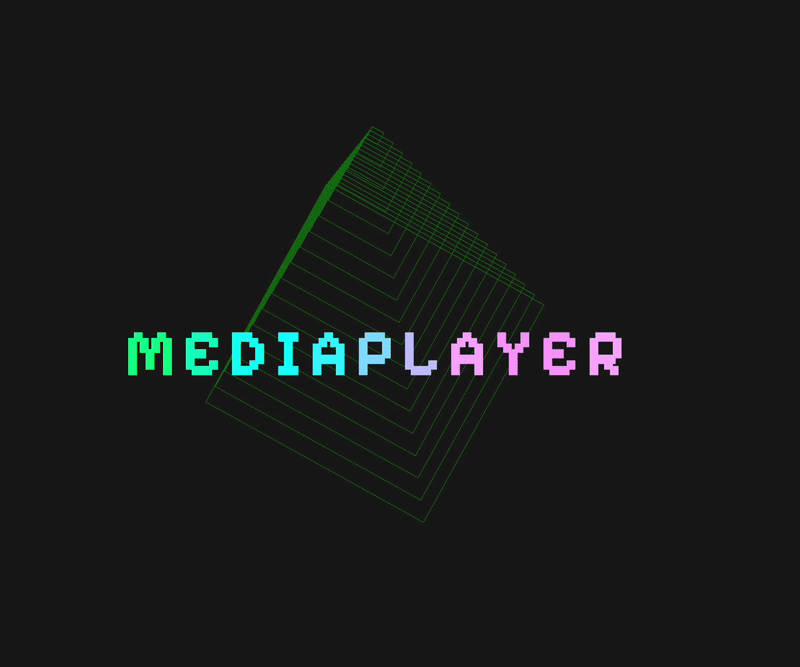
   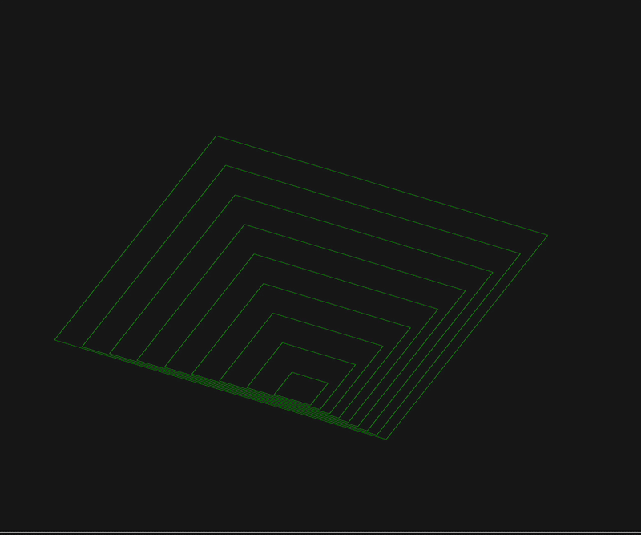
   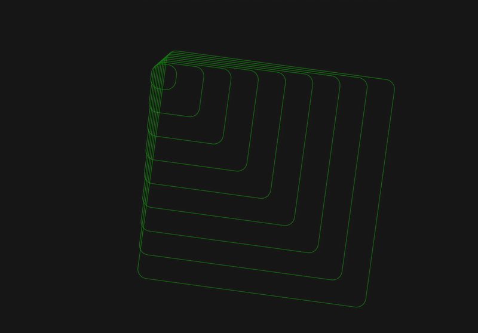
   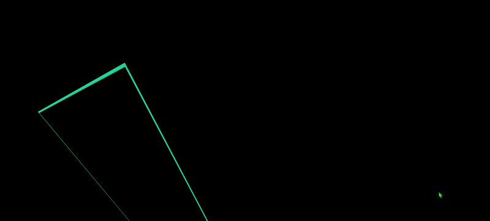
</details>

### dag 5
#### 11.3.2026

Checkout met Aya B

<b>Wat heb ik vandaag gedaan?</b>
Workshop van Sanne gevolgd.
color: color(display-p3 .5 .5 1);
de beste gradients maak je met oklsh()

[examples](https://cmda-minor-web.github.io/css-to-the-rescue-2526/)

### SVG filters
[alle filters in SVG](https://yoksel.github.io/svg-filters/)

```
<svg>
  <defs>
    <filter>
      //filter style
    </filter>
  </defs>
</svg>
```
[Noise in Codepen](https://codepen.io/alishasoedamah/pen/jEMVGWM?editors=1100)
[SVG convert](https://yoksel.github.io/url-encoder/)
[Video die ik heb gebruikt](https://www.youtube.com/watch?v=1bYAwpPPD6U)

Ik heb besloten om de interface te veranderen omdat er simpelweg nieg genoeg plek was voor de buttons in mijn oude panel.
Hier passen maar 4 buttons in en de vorm van de interface vond ik te lastig en niet meer mooi:
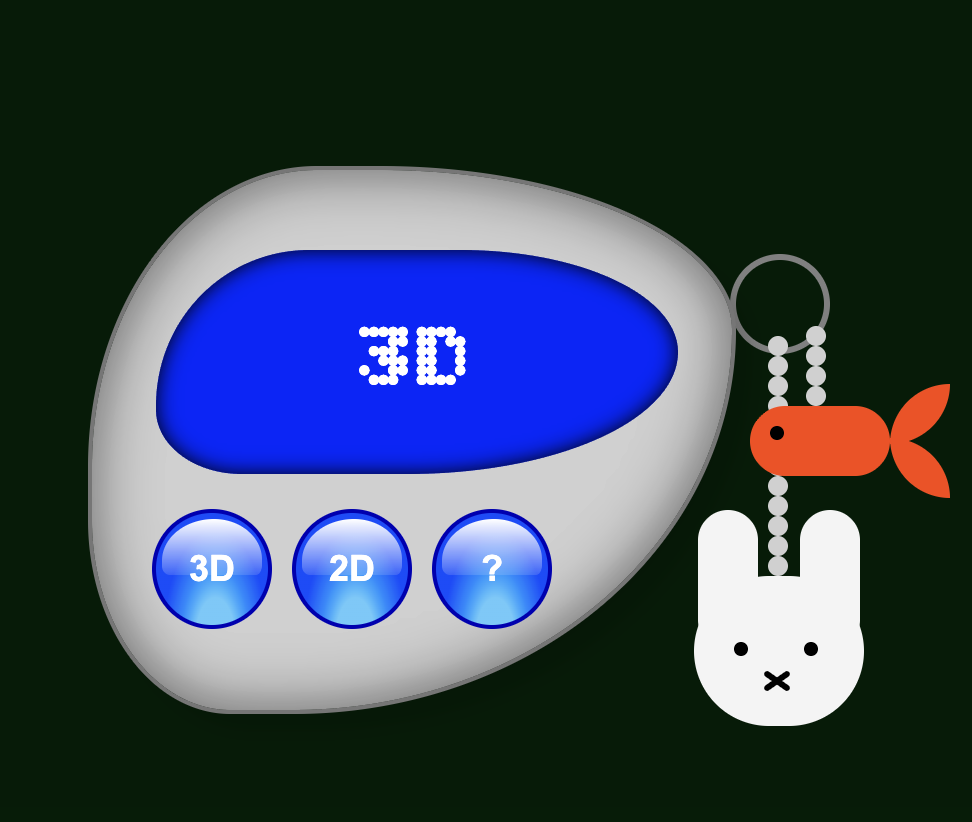

Zelfs met extra borders/kleur was het niet te redden
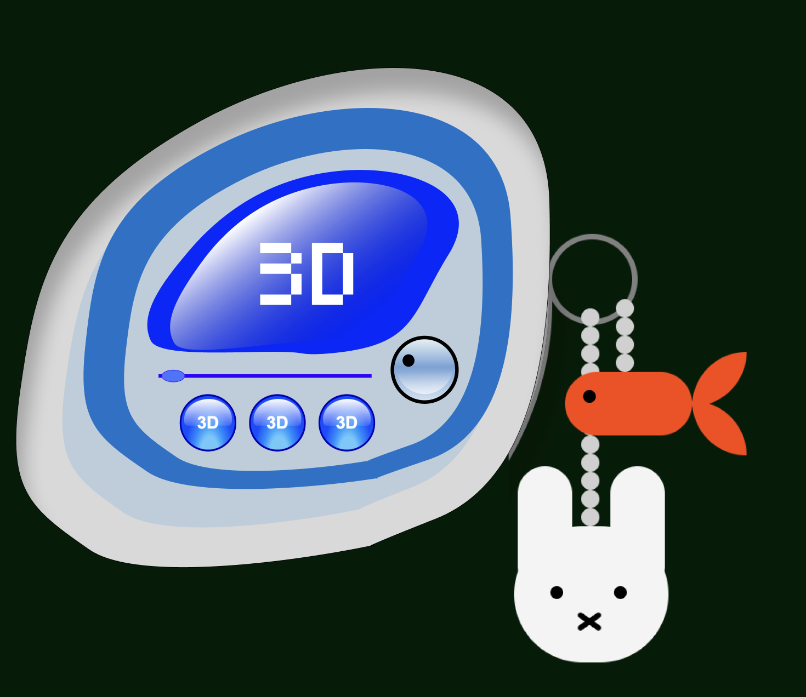

Ik nam vooral inspo van de interface van Winamp voro het nieuwe ontwerp:
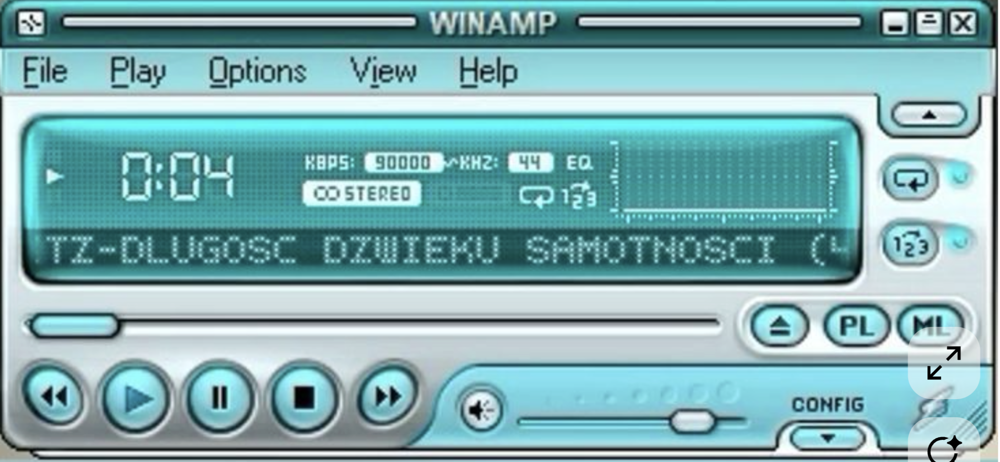

Dit is het idee van de nieuwe interface die ik aan het bouwen ben:
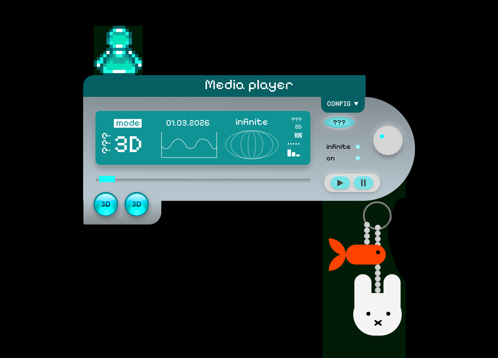

Hoe ik het (denk ik) ga uitbouwen met HTML tags
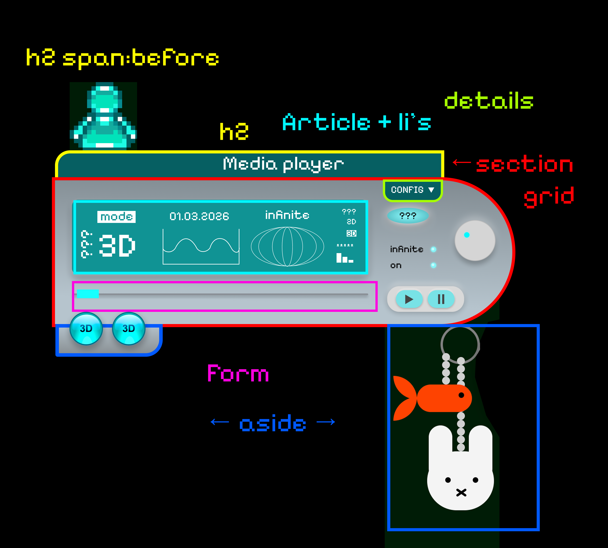

Nu wordt het meer een mix van tech/en de frutiger aero stijl

<b>Hoeveel tijd heeft me dat gekost?</b>
6 uur

<b>Wat heb ik geleerd?</b>
nth-of-type en SVG filters

<b>Wat ga ik morgen doen?</b>
De draaiknop af maken

### dag 6
#### 12.3.2026
Wat heb ik vandaag gedaan?
Veel tijd in de draaiknop gestopt. Ik moet nog een goede header maken voor de site maar daar ga ik volgende week aan zitten. 

Hoeveel tijd heeft me dat gekost?
de heledag

Wat heb ik geleerd?
@function en @container in css

### Week 3
<details>
   <summary>week 3 voortgang</summary>

   feedback die ik nog ga verwerken:

   - Maak een glare voor het scherm zodat je kunt zien dat het glas is
   - Meer border-radius voor de rand zodat het matched met de rest van het ontwerp
   - Box-shadow voor het scherm om het meer een geheel te maken
   - Maak de buttons in dezelfde stijl van het scherm
   - De titel moet nog af
   - de animatie moet nog af
   - architecture features moeten nuttig zijn
   - responsiveness van de site
   - het ziet er nu wel meer uit als één geheel
</details>

### dag 7 laatste dag!
#### 18.3.2026
Checkout met Sela 

Wat heb ik vandaag gedaan?
Noise filter toegevoegd aan de typografie van de website gewerkt

Hoeveel tijd heeft me dat gekost?
De heledag

Wat heb ik geleerd?
hoe pointer-events: none; werkt

### Week 4
<details>
   <summary>week 4 voortgang</summary>
</details>

<details>
   <summary>Waar ik trots op ben!</summary>

   - Deze button:
   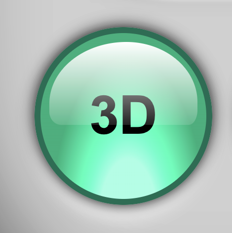

   - De charms op de chain:
   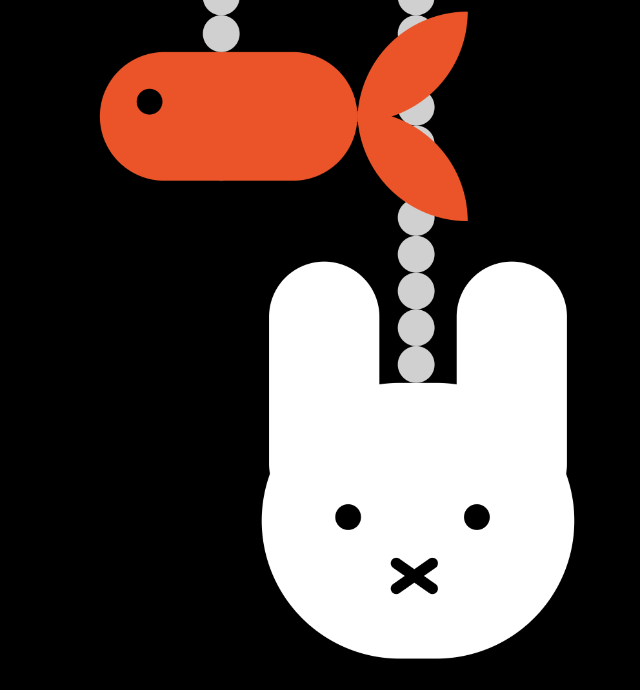

   - hem:
   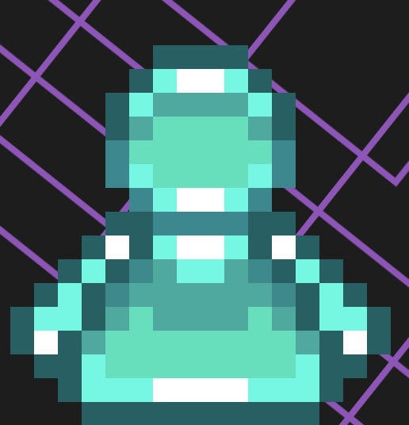
</details>

- What went smoothly, what was challenging, and what are you
most proud of?
The final design of the panel looks nice

- What experiments did you conduct that 'failed'?
Animation mainly, turn knob doesn't work

- Do you have new insights into how to leverage the power of CSS
(or not)
Too much stuff I didn;t know about, used sibling-index for a lot.

- What do you want to explore further?
DO more with @function and svg filters 

### Bronnen
- [Inner shadow](https://css-tricks.com/snippets/css/css-box-shadow/)
- [Fun shapes with border-radius](https://9elements.github.io/fancy-border-radius/#61.39.31.24--.)
- [Inset](https://developer.mozilla.org/en-US/docs/Web/CSS/Reference/Properties/inset)
- [:has](https://developer.mozilla.org/en-US/docs/Web/CSS/Reference/Selectors/:has)
- [last-of-type](https://developer.mozilla.org/en-US/docs/Web/CSS/Reference/Selectors/:last-of-type)
- [pixel-art refrence](https://itsfelpo.itch.io/frutiger-aero)
- [Play-pause functionality](https://developer.mozilla.org/en-US/docs/Web/CSS/Reference/Properties/animation-play-state)
- [@function](https://developer.mozilla.org/en-US/docs/Web/CSS/Reference/At-rules/@function)
- [sibling-index](https://developer.mozilla.org/en-US/docs/Web/CSS/Reference/Values/sibling-index)
- [hue-rotate](https://developer.mozilla.org/en-US/docs/Web/CSS/Reference/Values/filter-function/hue-rotate)
- [scherm deco](https://github.com/dy/linefont)
- [corner-shape](https://developer.mozilla.org/en-US/docs/Web/CSS/Reference/Properties/corner-shape)
- [corner-shape example](https://css-tricks.com/almanac/properties/c/corner-shape/)
- [paint-order](https://codepen.io/web-dot-dev/pen/dyxryKE)
- [animation ??? inspo](https://www.miriamsuzanne.com/2022/10/21/the-conic/)
- [playbtn shape](https://css-tricks.com/snippets/css/css-triangle/)
- [animation-fill-mode](https://developer.mozilla.org/en-US/docs/Web/CSS/Reference/Properties/animation-fill-mode)
- [animation-iteration-count](https://developer.mozilla.org/en-US/docs/Web/CSS/Reference/Properties/animation-iteration-count)
- [pointer-events](https://developer.mozilla.org/en-US/docs/Web/CSS/Reference/Properties/pointer-events)

> Layouts don't have to be boring - Nils
